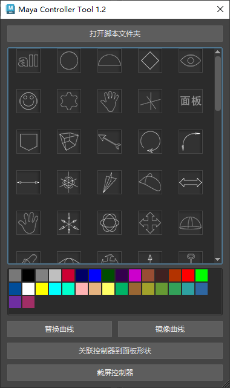

# Maya Controller Tool 1.2 — 使用说明

Maya Controller Tool 1.2 提供了丰富的控制器曲线库与颜色工具，支持替换/镜像曲线、批量着色、快速生成和管理控制器形状，适合动画与绑定快速搭建。

## 主要功能

- 控制器形状库：一键创建多种常用控制器形状（圆、齿轮、手型、箭头等）
- 颜色面板：提供常用色块，快速为控制器着色
- 替换曲线：将已存在控制器形状替换为库中任意形状
- 镜像曲线：按指定轴镜像控制器的形状
- 批量操作：支持对多选控制器进行统一处理

## 安装与运行

- 方式一：将 `MayaControllerTool 1.2/将此文件拖进Maya视口在工具架上添加图标.py` 拖入 Maya 视口，工具会添加到工具架
- 方式二：运行 `MayaControllerTool 1.2/使用方法01_直接运行（将此文件拖进Maya视口,该方式不支持中文路径）.py`
- 方式三：在脚本编辑器中执行项目根目录的 `install_ck_tool.py` 或通过 `ck_tool.run_tool()` 启动

## 目录结构（本模块）

- `MayaControllerTool/Lib/`：形状脚本与图标资源（`.mel`/`.py` 与 `.png`）
- `MayaControllerTool/maya_controller_tool.py`：核心逻辑
- `MayaControllerTool/qt_ui.py`：界面定义与布局
- `使用方法*.py`：拖拽/直接运行的启动脚本

## 使用提示

- 选择对象后，再执行替换/镜像等操作效果更佳
- 颜色设置会直接作用到控制器的显示属性
- 大量创建形状时，建议按需加载，避免场景过重

## 已知注意事项

- 若路径含中文，个别直接运行脚本可能受 Maya 版本与系统环境限制
- 建议在较新的 Maya 版本使用，确保 UI 与功能的最佳体验

---

© CK Tool Team
