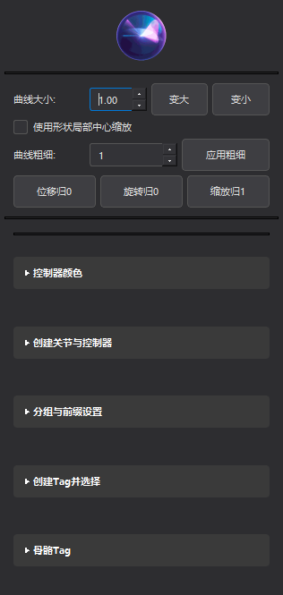
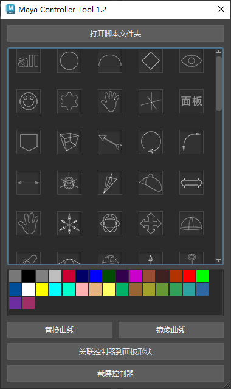

# CK Tool — Maya 综合工具

CK Tool 是一套面向 Maya 的综合效率工具集，集成了控制器管理、骨骼实用工具、标签系统等功能，配合统一的深色 UI 和可调整字体，帮助动画师与绑定师高效工作。



## 子模块文档

[](MayaControllerTool%201.2/README.md)

- 查看 Maya Controller Tool 1.2 的详细说明文档：`MayaControllerTool 1.2/README.md`

## 功能概览

- 控制器曲线：创建多种形状、调整大小、镜像形状、替换形状
- 控制器层级：快速搭建 Zero/Driven/Connect/Offset 等层级结构与 FK 链
- 颜色与样式：控制器颜色设置、批量着色、统一界面字体大小
- 骨骼工具：创建骨骼与控制器、旋转顺序与轴向设置、骨骼链识别
- 标签系统：添加/选择/删除 Tag，识别对象 Tag，保存历史记录
- 实用工具：合并/拆分曲线、随机/渐变颜色、重命名形状、形状重绑定等

## 安装与启动

### 方式一：拖拽安装（推荐）
1. 将 `install_ck_tool.py` 拖入 Maya 视口
2. 按提示完成安装，工具会添加到当前工具架

### 方式二：脚本启动
在 Maya 的脚本编辑器中执行：

```python
import ck_tool
ck_tool.run_tool()
```

## 使用说明

- 曲线大小：在顶部输入框中设置大小，支持放大/缩小与中心缩放
- 曲线组组数：设置批量创建的组数量并应用
- 快捷操作：位置归零、旋转归零、缩放归一
- 折叠面板：将功能分区折叠/展开，保持窗口尺寸稳定、操作更聚焦
- 字体大小：点击顶部图标进入全局字体大小设置，统一 UI 文本大小

## 目录结构

- `tool/`：核心工具脚本（控制器、颜色、曲线等）
- `controllers/`：控制器形状定义与管理
- `icons/`：工具图标与界面截图（README 使用 `icons/界面.png`）
- `ck_tool.py`：入口模块
- `ui.py`：界面逻辑
- `install_ck_tool.py`：安装脚本

## 常见问题

- 中文路径问题：如遇拖拽安装不支持中文路径，请使用脚本启动方式
- 撤销支持：所有操作遵循 Maya 撤销机制，可放心试验
- 兼容性：推荐在较新的 Maya 版本使用，若遇到兼容问题可反馈

## 更新日志（摘录）

- UI 改进：折叠/展开不再改变窗口大小，仅影响内部布局
- 字体大小：新增全局字体大小设置，统一按钮、标签、折叠组等文本大小
- 性能优化：减少不必要的窗口调整，提升响应速度与稳定性

---

© CK Tool Team
